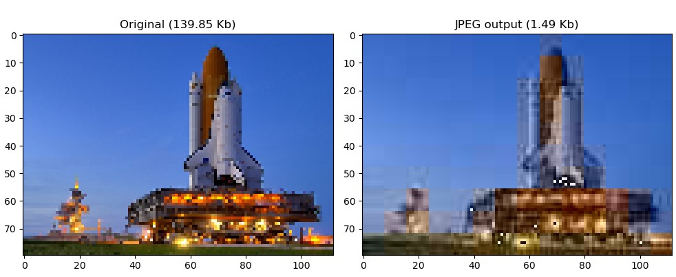

# JPEG in Pure Python

This is a pure python implementation of the JPEG compression algorithm.

My learning sources:
- [Dr. Bill Bird (University of Victori) CSC485B course](https://www.youtube.com/watch?v=95D99HEn4xU&list=PLU4IQLU9e_OpnkbCS_to64F_vw5yyg4HB)
- [Computerphile Video (University of Nottingham )](https://www.youtube.com/watch?v=Q2aEzeMDHMA&list=PLSL85pYTZnmvQVOfuK_1XuxUX9e6XSiGA&index=2)

To give it a try, change the below line in [jpeg_works.py](jpeg_works.py) and run the file.

`file_name = 'shuttle.jpg'`

example:

This design is focused on aggresive size reduction.
As opposed to regular JPEG tools, which offer only one parameter for quality/size adjustment,
this code gives to access to 5 different parameters to squeeze that image data as much as possible.

### Quality/Size Parameters
1. **downsample_pixel_count**
    
    This parameter is used in down-sampling Cr and Cb cahnnels.
    Use integer values starting from 1.
    Higher values result in lower quality.

2. **dtc_depth_y**
    
    Y channel quality.
    Use integer values between 1 and 64. Higher value results in better quality.

3. **dtc_depth_cb**
    
    Cb channel quality. Use integer values between 1 and 64. Higher value results in better quality.

4. **dtc_depth_cr**

   Cr channel quality. Use integer values between 1 and 64. Higher value results in better quality.

5. **qt_factor**

   Overall quality. Integer values from 1 to +inf. Higher value results in lower quality.
    This is the same parameter that regular JPEG tools offer the users to adjust for the output quality.
